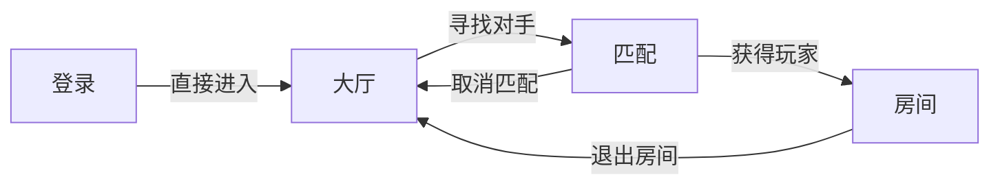
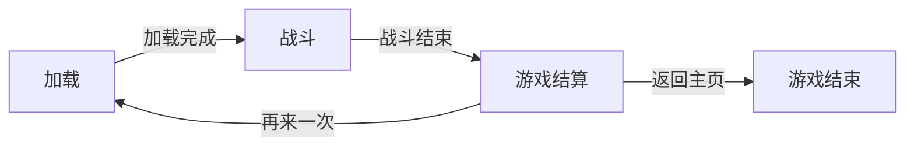
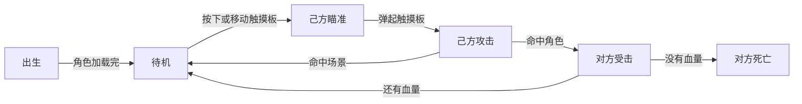

# 小游戏应用
add by jaunwang at 2025-08-12
## 背景
在元梦中，需要大量精品小游戏来推进UGC生态演化
## 架构
|目录名称|功能说明
|:------|:------|
|Config|这里是配置信息
|FSM|游戏状态机
|Helper|一些辅助工具
|Module|功能模块
|World|游戏世界
## 状态
* 局外

```mermaid
graph LR;
    LoginState[登录] -->|直接进入| LobbyState[大厅]
    LobbyState -->|寻找对手| MatchState[匹配]
    MatchState -->|获得玩家| RoomState[房间]
    MatchState -->|取消匹配| LobbyState
    RoomState -->|退出房间| LobbyState
```
* 局内

```mermaid
graph LR;
    LoadingState[加载] -->|加载完成| BattleState[战斗]
    BattleState -->|战斗结束| ResultState[游戏结算]
    ResultState -->|返回主页| OverState[游戏结束]
    ResultState -->|再来一次| LoadingState
```
* 角色

```mermaid
graph LR;
    BirthState[出生] -->|角色加载完| IdleState[待机]
    IdleState -->|按下或移动触摸板| AimState[己方瞄准]
    AimState -->|弹起触摸板| FireState[己方攻击]
    FireState -->|命中角色| HitState[对方受击]
    HitState -->|没有血量| DeathState[对方死亡]
    FireState -->|命中场景| IdleState
    HitState -->|还有血量| IdleState
```
